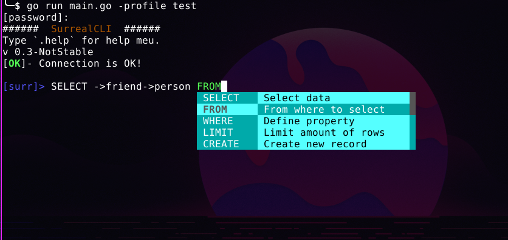
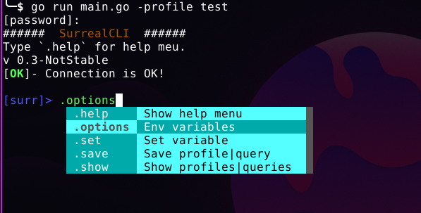

# SurrealCLI

SurrealCLI is client command line tool for managing [SurrealDB](https://surrealdb.com/). It supports many types of usages as interactive mode and noninteractive use, which lets you pass your query through the command line.

SurrealCLI allows you to manage several profiles and then connect to another database without opening another terminal or leaving your current session.

It even has **autocomplete** and **suggestions** feature which can be managed as well.



It is just download and run (if you have Golang env configured).
```bash
git clone https://github.com/farinap5/SurrealCLI.git
cd SurrealCLI
go build SurrealCLI
```
**Normal Connection**
In this case, as you are not passing the password as argument you'll need to enter your password in response to the prompt that SurrealCLI displays:
```
surrcli -host "0.0.0.0:80" -u elf -ns surr -db surr -comp 0              
[password]: 
######  SurrealCLI  ######
Type `.help` for help meu.
v 0.3-NotStable
[OK]- Connection is OK!
```
After receiving the feedback, it is ready to type the SurrealQL statements:
```
[surr]> INFO FOR DB;
[
  {
    "time": "273.293µs",
    "status": "OK",
    "result": {
...
```
Typing **Control-D** interrupts the prompt.

### Help Menu
```
─$ surrcli --help

COMMAND   DESCRIPTION                 DEFAULT
-------   -----------                 -------
-u        Username                    root
-p        Password                    hide password
-host     Database address "IP:PORT"  0.0.0.0:80
-NS       Namespace                   surr
-DB       Database                    surr
-sc       Schema                      http
-profile  Connect to a profile        none
-t        Connection timeout          5
-pretty   Pretty output               true
-comp     Number of suggestions       5
```



```
[surr]> .help

COMMAND   DESCRIPTION
-------   -----------
.help     Show help menu
.options  Env variables
.set      Set variable
.save     Save profile|query
.show     Show profiles|queries
.delete   Delete profile|query
.run      Run profile|query
```

The command `.options` shows the variables you can change the value.

`.set` Lets you to chage the variables value, those variable shown with `.options` command, take the database addres as example so you can comunicate to another database just setting it like:

```
[surr]> .set host 1.1.1.1
```

The `.save` is used when we want to save a `profile` or `query` to use later. Typing `.save profile <any name>` will save the current connection configuration. You can connect to another database by the saved `profile` just typing `.run profile <chosen name>`

Those commands (`.save` and `.run`) can be used in queries context, its possible to save a query using the command:

```
[surr]> .save query <any name>
```
This will save the last executed query, we can run it again just typing `.run query <chosen name>`.

`.show` is used to list the saved `profiles` and `queries`.

```
[surr]> .show queries

ID  NAME        QUERY
--  ----        -----
1   dbinfo      info for db;
2   elffriends  select ->friend->person.name from (select id from person where name="elf");
...
```

`.delete` delete `profile|query

Authenticate with saved profile using `-profile`
```
╰─$ surrcli -profile anyprofile -p $PXX
######  SurrealCLI  ######
Type `.help` for help meu.
0.3-NotStable
[OK]- Connection is OK!

[surr]> .options

VARIABLE    VALUE
--------    -----
Host        0.0.0.0:80
User        elf
Namespace   surr
Database    surr
Schema      http
Pretty      true
Timeout     5ns
Suggestion  5

[surr]> 
```

It is possible to have profiles from several databases saved, you can switch connections by applying a `.run profile xxx`, and you will be communicating with another database. Or you can pass a saved profile to connect to as argument.

Profile does not keep password.
```
╰─$ surrcli -profile test -p $PXX -q "INFO FOR DB;"
[
  {
    "time": "271.87µs",
    "status": "OK",
    "result": {
      "dl": {},
      "dt": {},
...
```

SurrealCLI supports data being passed through stdin:
```
╰─$ echo "select * from person;" | go run main.go -profile test -p $PASS
[
  {
    "time": "438.374µs",
    "status": "OK",
    "result": [
      {
        "id": "person:cxnpkua4g13nd6vjmypl",
        "name": "Person1"
      },
...
```